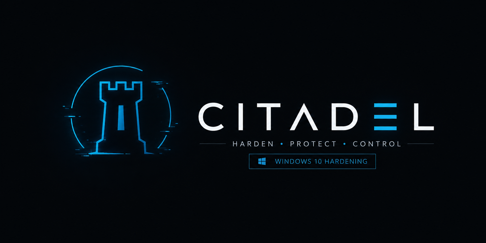

# Citadel — Autonomous Hardening Engine



## 🛡️ About

**Citadel** is an **autonomous AI agent** engineered for elite OS security hardening and tactical configuration management on Windows 10/11. It operates beyond the scope of a simple script — it is a full agentic engine with persistent memory, a structured knowledge vault, an autonomous auto-remediation cycle, and surgical runtime validation capabilities.

> [!IMPORTANT]
> Designed **exclusively** to operate natively within the **Antigravity** ecosystem. The `AGENTS.md` file serves as the engine's initialization briefing, loaded at the start of every new session to restore full operational context.

---

## 🚀 How to Use Citadel

Using Citadel is designed to be interactive and heavily automated. You do not run PowerShell scripts manually — you command the agent, and the agent does the heavy lifting.

### Step-by-Step Execution

1. **Load the Agent:** Open this project directory (`hardening_script-windows10`) inside your **Antigravity** workspace.
2. **Ensure Admin Privileges:** Citadel executes system-level PowerShell commands. **Antigravity must be opened as an Administrator** to ensure the environment has the necessary elevated rights.
3. **Trigger the Engine:** In the Antigravity chat, type the trigger word:
   ```text
   hardening
   ```
4. **Review the Audit:** Citadel will autonomously run a Pre-Flight Check and a Read-Only Audit across 16+ security vectors. It will present a Markdown table with the vulnerabilities found.
5. **Command the Fixes:** When Citadel asks *“Quais tópicos deseja aplicar?”*, simply reply with the numbers you want to fix (e.g., `1, 3, 14`).
6. **Watch the Auto-Remediation:** Citadel will automatically backup the registry, apply the fixes, validate them, and use its cascading remediation strategies if any fix throws an `Access Denied` or similar error.

### 💾 Automatic Backups
Before making any changes to the system registry during the **Apply** phase, Citadel automatically creates targeted `.reg` backups for the specific registry keys affected by the chosen topics. These backups are safely stored in the `backups/` directory and are timestamped (e.g., `backup-[topic]-[timestamp].reg`). Citadel strictly ensures that only valid `.reg` files are placed in this directory, providing a granular and reliable way to revert individual modifications if ever needed. Topics that do not modify the registry will bypass the backup creation entirely.

### 🛑 Session Interruptions
If your session drops or you need to restart the audit mid-way, you can simply type `hardening` again. Citadel is strictly **idempotent**. The Pre-Flight Audit will naturally detect the fixes that were already applied as `✅ SEGURO` and will skip them safely. It will never duplicate configurations or double-backup untouched keys.

### 💻 Command Interface

| Command | Action |
| :--- | :--- |
| `hardening` | Launch the full audit cycle: Pre-Flight → Audit → Question → Apply → Remediate. |
| `hardening upgrade` | Trigger the Autonomous Evolution Cycle (self-upgrade of Doctrine + Vault by adding new attack vectors). |

---

## 🎯 Recommended Model

To ensure maximum technical precision and depth of reasoning during the remediation loop:

> [!WARNING]
> **Recommended:** Claude Sonnet 4.6+, Gemini 3.1 Pro, or equivalent frontier model with extended thinking.
> Using lower-capability models will compromise the detection of complex PowerShell error stacks, autonomous evolution quality, and the execution of the cascading remediation strategies.

---

## 🧠 Architecture

Citadel operates as a **4-layer autonomous engine**:

| Layer | Role | Location |
| :--- | :--- | :--- |
| **Layer 1 — Doctrine Index** | Lightweight persistent memory linking all tactical capabilities. | `directives/hardening-doctrine.md` |
| **Layer 2 — AI Engine** | Real-time PowerShell execution, error reasoning, and auto-remediation. | *(you — the LLM runtime)* |
| **Layer 3 — Ad-Hoc Tooling** | Ephemeral PowerShell scripts for surgical runtime validation. | `.tmp/` *(discarded after use)* |
| **Layer 4 — Security Vault** | 16+ tactical knowledge files covering critical attack vectors. | `directives/vault/` |

---

## ⚖️ Golden Principle

> You execute. You validate. You remediate. The user only approves — the heavy lifting is yours.
> The vault grows. The `.tmp/` never accumulates garbage. The `reports/` holds only true value.

---

<p align="center">
  <i>Developed by <b><a href="https://github.com/pedrosilvaevangelista">Pinkman</a></b></i>
</p>
